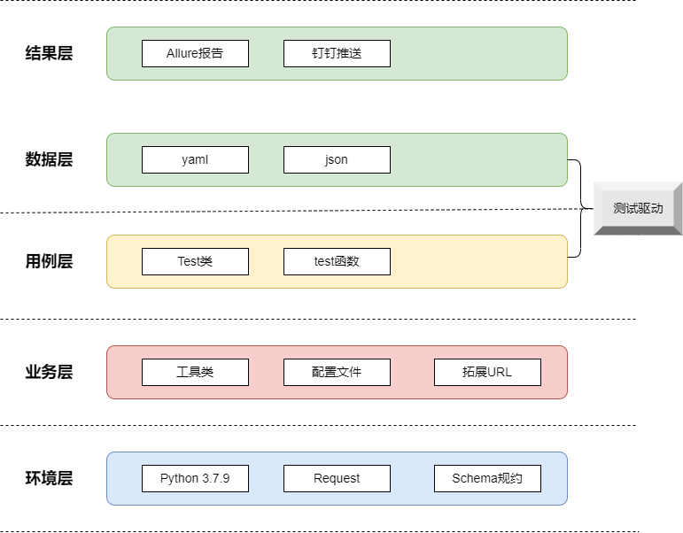

### 介绍

> **框架介绍** ：基于schema规约  

> **框架类型** ：接口自动化测试框架

### 技术

* 开发语言：*Python 3.7.9*
* 开发环境：*Visual Studio Code*
* 开发工具：
  * 请求工具：*Requests*
  * 响应获取：*Jsonpath*
  * 断言工具：*Hamcrest*
  * 测试框架：*Pytest*
  * 测试报告：*Allure*
  * Web服务：*Fastapi*

### 结构

  * [框架结构](https://www.processon.com/view/link/624e3c3e1e085332f32e7c17)  
  * 架构图  
  